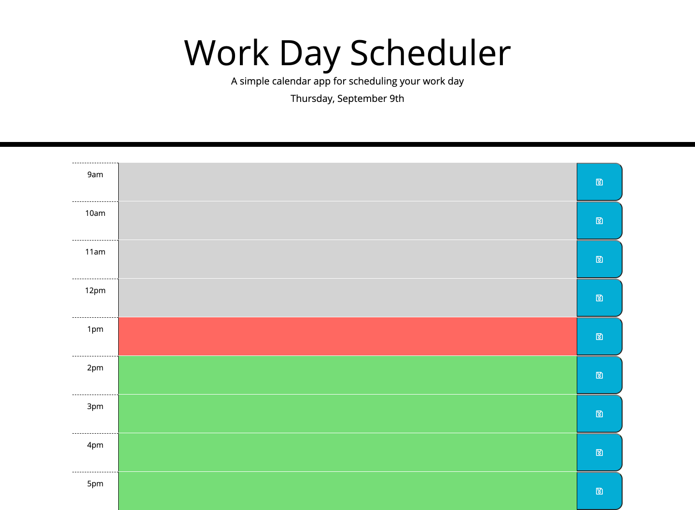
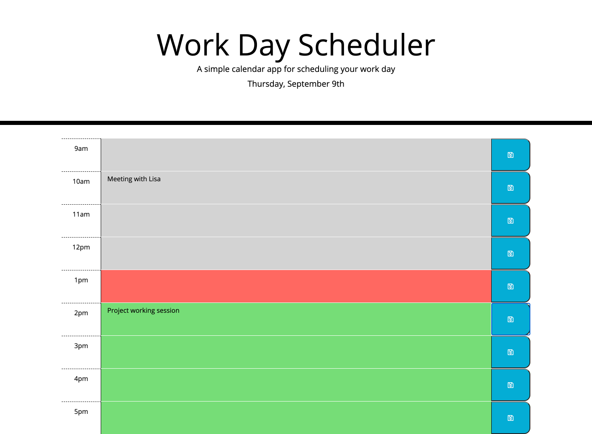

# Work Day Scheduler (Homework 5)

This project is for a Work Day Scheduler. It allows the user to add things to their schedule for that day. It displays a section for each hour of a typical work day from 9am to 5pm. When the user clicks on one of the text areas for an hour they can then input whatever activity or reminder they wish. When they click save, whatever they have input will be saved to local storage so that if they refresh the page the input is still in the correct hour.

The Work Day Scheduler also has the capability of showing the past, present and future hours based on the styling of the hour rows. The row for the current hour will be shown in red, future hours will be shown in green and past hours in grey. 

View the Work Day Scheduler here:
[Work Day Scheduler](https://kmwine02.github.io/homework05/)

and the repository here:
[GitHub Repository](https://github.com/kmwine02/homework05) 

 

--------

Below is what the Work Day Scheduler looks like when it is first opened and when you add details to some of the hour rows. There is a section at the top that tells you the current date and day of the week.

